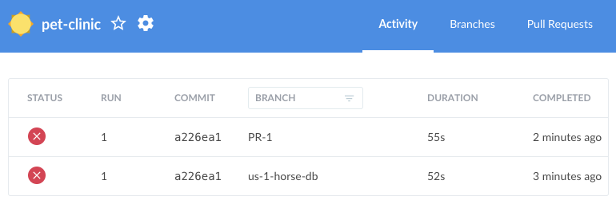
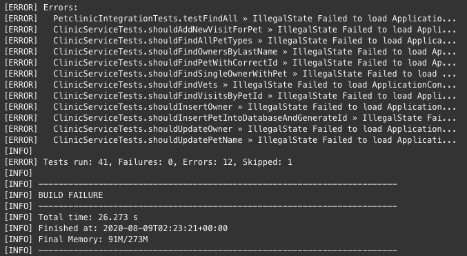
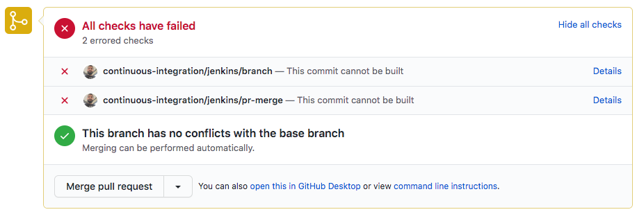

## Ejecución del Job en Jenkins

* Apenas se creó el pull request, **GitHub notificó a Jenkins** que ejecuté el pipeline de integración continua.

* Ingresa a Jenkins para ver qué está sucediendo <a href="https://[[HOST_SUBDOMAIN]]-8080-[[KATACODA_HOST]].environments.katacoda.com/blue/organizations/jenkins/pet-clinic/activity/" target="jenkins">https://[[HOST_SUBDOMAIN]]-8080-[[KATACODA_HOST]].environments.katacoda.com/blue/organizations/jenkins/pet-clinic/activity/</a>

* Observarás que está en progreso (o finalizó) la ejecución de un pipeline asociado al Pull Request.

  

    ✏ **Nota**: Encontrarás dos ejecuciones: la primera corresponde al commit en la rama y la última corresponde a la creación del pull request.

* Haz click en la ejecución para revisar su detalle.

* Al inicio de la página verás el gráfico de ejecución del pipeline (si ya terminó la ejecución, al ingresar a la ejecución te mostrará directamente los logs de error, desplázate hasta el inicio de la página para ver el gráfico).

  

* Las tareas que ejecuta este pipeline son las siguientes:
    * **Descargar las dependencias de la aplicación** (etapa 'Build').
    * **Compilar la aplicación** (etapa 'Build').
    * **Ejecutar Pruebas Unitarias** (etapa 'Build').
    * **Ejecutar Pruebas de Integración** (etapa 'Build').
    * **Publicar los Resultados de las Pruebas** (etapas 'Publish Unit Tests Results').
    * **Crear y Publicar la Imagen Docker** (etapa 'Create and Publish Docker Image')
    * **Desplegar en Desarrollo** (etapa 'Deploy Development')

* La etapa **Build** ha encontrado un error. Haz click en esta etapa y revisa brevemente los logs, **encontrarás que algunas pruebas han fallado.**

  

## Revisión del Pull Request

* Retorna a la ventana de GitHub, te encontrarás en la pantalla del **Pull Request**.

* A mitad de la página observarás el mensaje **All Checks have failed**.  Los resultados de la ejecución del pipeline de Jenkins están disponibles directamente en el pull request. 

  

## ¿Cuál es la mecánica de funcionamiento?

* Cuando el Pull Request es creado, GitHub notifica a Jenkins a través de un Web Hook.
  
  ✏ **Nota**: Los **Webhooks** se usan para notificar a otras aplicaciones de eventos en Github, como por ejemplo la creación de un Pull Request. Opcionalmente puedes revisar la configuración del webhook en [https://github.com/[your_username]/pet-clinic/settings/hooks](https://[[HOST_SUBDOMAIN]]-9876-[[KATACODA_HOST]].environments.katacoda.com/#hooks).

* Cuando Jenkins es notificado, lee el contenido del archivo **Jenkinsfile** en la raiz del repositorio de código. Este archivo tiene la implementación de todas las etapas del pipeline de Integración Continua.
  
* Cada etapa obtenida del Jenkinsfile es ejecutada en el servidor de Jenkins.

* Revisa brevemente el archivo [`Jenkinsfile`](https://[[HOST_SUBDOMAIN]]-9876-[[KATACODA_HOST]].environments.katacoda.com/#jenkinsfile) del repositorio Pet Clinic.