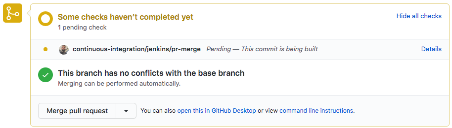
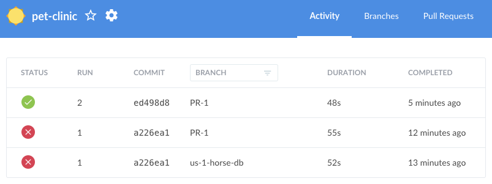

Vamos a agregar nuevos cambios al Pull Request para corregir el error.

* Ingresa al listado de pull requests en GitHub [https://github.com/[your_username]/pet-clinic/pulls](https://[[HOST_SUBDOMAIN]]-9876-[[KATACODA_HOST]].environments.katacoda.com/#pr) y abre el pull request que acabas de crear.

* En el tab "**Files changed**", edita el archivo `data.sql` haciendo click en el menú "**...**" cerca del nombre del archivo, y selecciona "**Edit file**". 

* Reemplaza la línea "Jolly Jumper, con la siguiente línea `INSERT INTO pets VALUES (14, 'Jolly Jumper', '2012-09-20', 7, 5);`{{copy}}

* En la sección **Commit changes**, ingresa un comentario, por ejemplo `US #1: Fix parenthesis`{{copy}}

* Realiza commit del código en la misma rama `us-1-horse-db`.

* Regresa al tab **Conversation** del Pull Request. 

* Observarás que GitHub notificó nuevamente a Jenkins para que ejecute el pipeline. 

    
  
* Espera a que finalice la ejecución. Apenas finalice, en el pull request se mostrará el mensaje **All checks have passed**.

* Opcionalmente puedes ingresar a Jenkins <a href="https://[[HOST_SUBDOMAIN]]-8080-[[KATACODA_HOST]].environments.katacoda.com/blue/organizations/jenkins/pet-clinic/" target="jenkins">https://[[HOST_SUBDOMAIN]]-8080-[[KATACODA_HOST]].environments.katacoda.com/blue/organizations/jenkins/pet-clinic/activity/</a> para revisar la ejecución.

