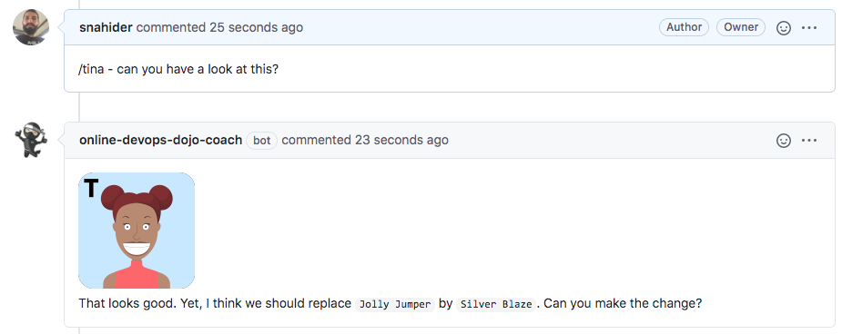

Ahora que todas las verificaciones automáticas han pasado. Es momento de **involucrar a Tina la tester para que realice una revisión de pares**.

✏ **Nota**: Para propósitos prácticos, Tina será el bot que conectaste a tu repositorio como parte del setup.

* Ingresa al listado de pull requests en GitHub [https://github.com/[your_username]/pet-clinic/pulls](https://[[HOST_SUBDOMAIN]]-9876-[[KATACODA_HOST]].environments.katacoda.com/#pr) y abre tu pull request.

* Al final de la página, agrega un comentario para preguntar a Tina que revise el pull request: `/tina - can you have a look at this?`{{copy}}

* Tina luego de revisar los cambios, te pedirá que realices unos pequeños ajustes.

* Ingresa al tab "**Files changed**", edita el archivo `data.sql` haciendo click en el menú "**...**" cerca del nombre del archivo, y selecciona "**Edit file**".

* **Realiza los cambios que te pide hacer Tina** y realiza commit del código en la misma rama.

* Jenkins ejecutará nuevamente el pipeline con el último cambio para asegurarse que todas las verificaciones están pasando..
  
* Cuando el pipeline haya finalizado OK, en el pull request aparecerá el mensaje **All checks have passed**.