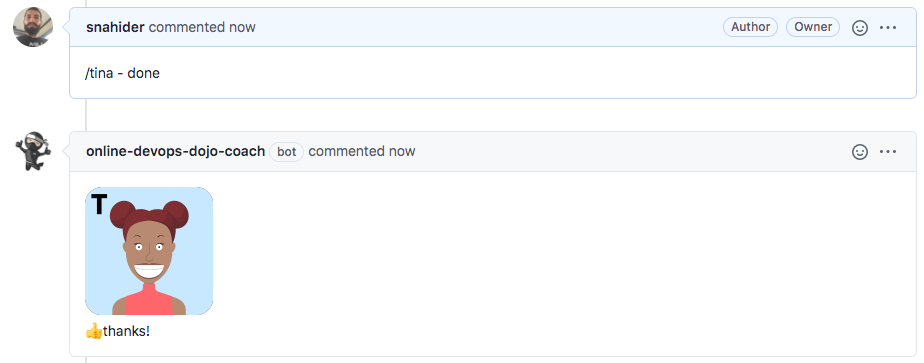

* Es momento de involucrar a Tina nuevamente para que revise último cambio, escribe el comentario `/tina - done`{{copy}}

* Tina revisará y comentará positivamente los cambios.

* Realiza un merge del pull request haciendo click en el botón "**Merge pull request**", y confirma el merge "**Confirm Merge**".
  
* Elimina la rama `us-1-horse-db` haciendo click en el botón "**Delete Branch**"

* Ahora que has realizado el merge del pull request, el nuevo código ya se encuentra integrado en la rama `master`.

* Puedes revisar el historial de los cambios en [https://github.com/[your_username]/pet-clinic/commits/master](https://[[HOST_SUBDOMAIN]]-9876-[[KATACODA_HOST]].environments.katacoda.com/#commits)