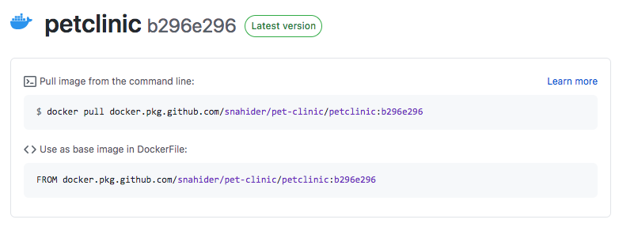

✏ **Nota**: Una de las tareas que ha ejecutado el pipeline de Continuous Integration es **generar y publicar una imagen Docker**. En el siguiente laboratorio promocionarás esta imagen Docker en los ambientes de Calidad y Producción, a través de un pipeline de Continuous Delivery.

Revisa la imagen Docker publicada como parte del proceso de Continuous Integration.

* Ingresa a la raiz del repositorio [https://github.com/[your_username]/pet-clinic](https://[[HOST_SUBDOMAIN]]-9876-[[KATACODA_HOST]].environments.katacoda.com/#repo)

* En la parte derecha de la página observarás la sección **Packages**. Deberás encontrar la imagen docker **petclinic**.

* Click en el paquete **petclinic** para ver su detalle.

    

✏ **Nota**: **GitHub Packages** permite gestionar paquetes (Docker, Npm, War, etc.) dentro del mismo proyecto de GitHub.