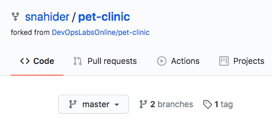
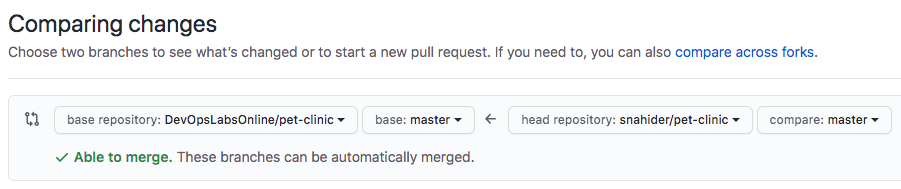
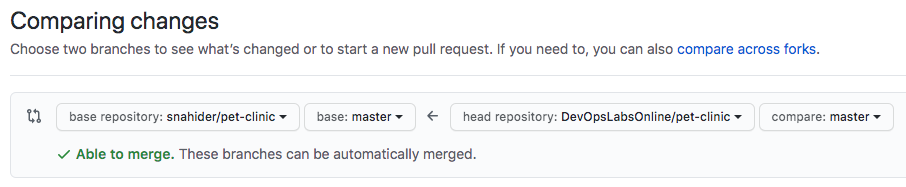
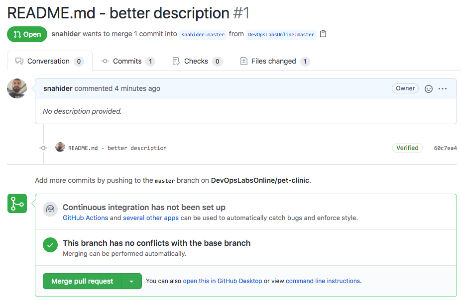
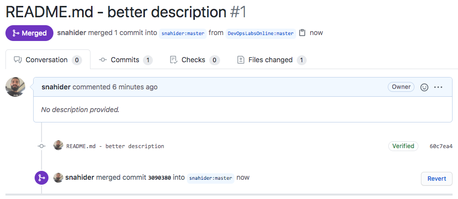

Para el funcionamiento del laboratorio necesitas actualizar el repositorio pet-clinic de tu cuenta. Para esto descargarás algunos cambios del repositorio base `DevOpsLabsOnline/pet-clinic`.

* En GitHub, ingresa a tu repositorio de código fuente **https://github.com/[your_username]/pet-clinic**

    

* En tu repositorio de Github, ingresa al **tab 'Pull request'.**

* Haz click en el botón **New pull request**.

* Cargará la página **Comparing Changes**. 

    
  
* Debajo del título habrá una sección con 4 listas desplegables. Estas listas desplegables permiten indicar si quieres enviar o descargar cambios de otro repositorio.

* Realiza estos pasos para indicar que el origen es `DevOpsLabsOnline/master` y el destino `[your_username]/pet-clinic`.
    * En el combo de la izquierda seleciona el repositorio `[your_username]/pet-clinic`.
    * Haz click en el enlace **compare across forks**, que se encuentra encima de las listas desplegables.
    * En el combo de la derecha selecciona el repositorio `DevOpsLabsOnline/master`.

* Asegúrate que la petición queda **'[your_username]/pet-clinic' <- 'DevOpsLabsOnline/pet-clinic'**

    

* Haz click en el botón **Create Pull Request**

* En la página **Open a pull request**, haz click en el botón **Create pull request**

* Cargará la página con la descripción del **Pull request** (es posible que el título y la lista de cambios sea diferente).

    

* Haz click en el botón **Merge pull request**, y luego **Confirm merge**.

* Al finalizar aparecerá página similar a la siguiente.

    