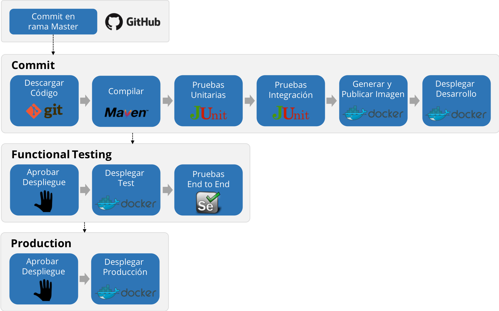

El delivery pipeline que implementaremos tendrá la siguientes características.

* **Iniciará apenas se detecte un cambio en la rama** `Master`.
  
* **Incluirá las etapas del pipeline de Continuous Integration**: Compilar, Pruebas Unitarias,  Pruebas de Integración, Generar y Publicar la Imagen Docker, Desplegar en Desarrollo.

* **Etapas para validar funcionalmente el cambio en el Ambiente de Test**: Aprobación para Desplegar en Test (etapa manual a demanda), Desplegar en Test, Pruebas End to End de UI.

* **Etapas para desplegar en Producción**: Aprobación para Desplegar en Producción (etapa manual a demanda), Desplegar en Producción.

En los siguienes pasos agregarás las nuevas etapas al pipeline.