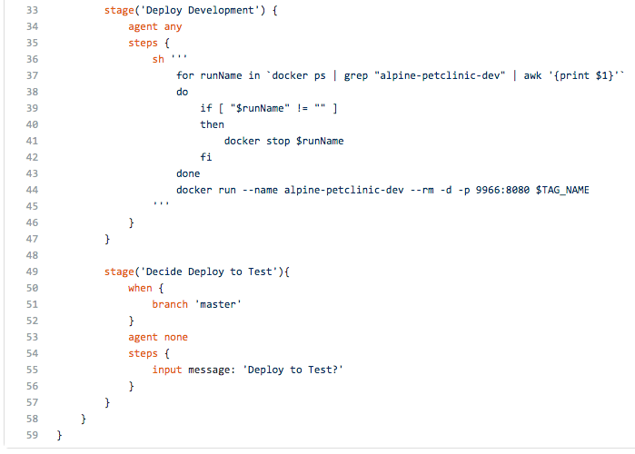
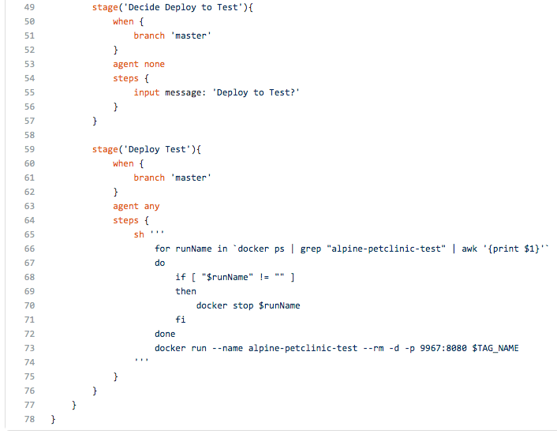
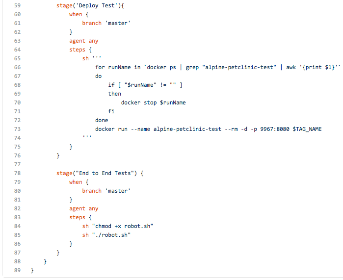
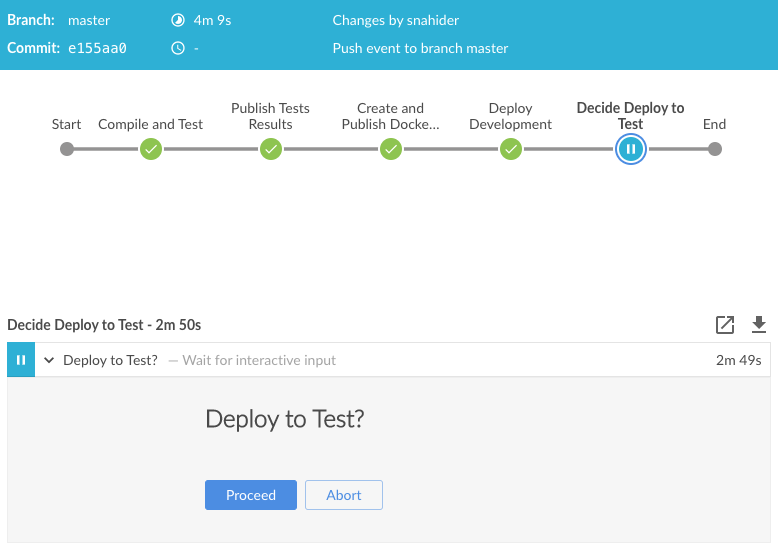
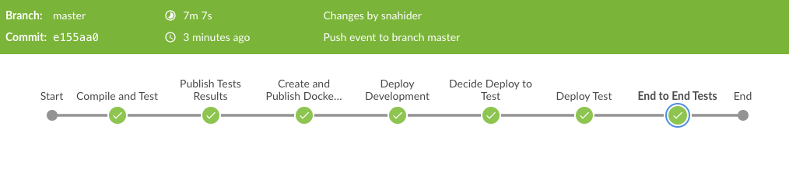
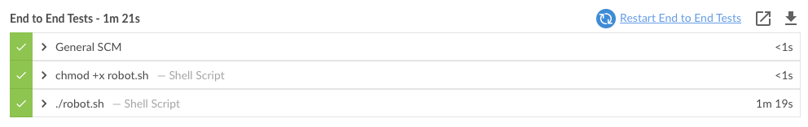
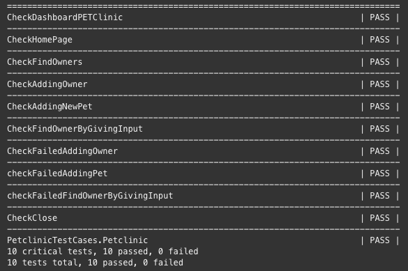

## Agregar Etapas en Jenkinsfile

Editarás el archivo `Jenkinsfile` para agregar etapas al pipeline.

* Abre Github y navega hasta el archivo [`Jenkinsfile`](https://[[HOST_SUBDOMAIN]]-9876-[[KATACODA_HOST]].environments.katacoda.com/#jenkinsfile) del repositorio Pet Clinic.

* Para editar el archivo, has click en el **ícono de lapiz** en la parte superior derecha del archivo.

* Agrega las siguientes etapas al pipeline.

**1. Aprobación del tester para iniciar el despliegue en el ambiente de Test** 

* Debajo de la línea 47, debajo del bloque `stage('Deploy Development'){..}`, agrega las siguientes líneas:

  <pre class="file" data-target="clipboard">
  stage('Decide Deploy to Test'){
      when {
          branch 'master'
      }
      agent none
      steps {
          input message: 'Deploy to Test?'
      }            
  }
  </pre> 

  ✏ **Nota**: la directiva `when { branch 'master' }` le indica al pipeline que el stage solo se ejecutará en la rama `master`.

  ✏ **Nota**: el step `input` pausa la ejecución del pipeline y permite a una persona interactuar y controlar el flujo del pipeline (continuar o cancelar, proveer información).

* Deberá quedar similar a la siguiente imagen.

  

**2. Desplegar en Test** 

* El despliegue consiste en detener el contenedor anterior y ejecutar la nueva versión del contenedor.

* Debajo del bloque `stage('Decide Deploy to Test'){..}`, agrega las siguientes líneas:

  <pre class="file" data-target="clipboard">
  stage('Deploy Test'){
      when {
          branch 'master'
      }
      agent any
      steps {
          sh '''
              for runName in `docker ps | grep "alpine-petclinic-test" | awk '{print $1}'`
              do
                  if [ "$runName" != "" ]
                  then
                      docker stop $runName
                  fi
              done
              docker run --name alpine-petclinic-test --rm -d -p 9967:8080 $TAG_NAME
          '''
      }
  }
  </pre> 

  ✏ **Nota**: el step `sh` ejecuta cualquier script de linux.

* Deberá quedar similar a la siguiente imagen.

  

**3. Pruebas End to End**

* En la carpeta `/src/test/selenium-robot` hay pruebas automatizadas de interfaz gráfica utilizando **selenium**.

  ✏ **Nota**: **Selenium** es un framework que permite automatizar la interacción con páginas web a través del navegador.

* Las pruebas se ejecutarán sobre un navegador Firefox que se levantará en un contenedor, al finalizar las pruebas se retornarán los resultados y se apagará el contenedor. Toda esta lógica se encuentra en el archivo `./robot.sh`.

* Debajo del bloque `stage('Deploy Test'){..}`, agrega las siguientes líneas:

  <pre class="file" data-target="clipboard">
  stage("End to End Tests") {
      when {
          branch 'master'
      }
      agent any
      steps {
          sh "chmod +x robot.sh"
          sh "./robot.sh"
      }
  }    
  </pre>

* Deberá quedar similar a la siguiente imagen.

  

## Probar el pipeline

* En la sección **Commit changes**, ingresa un comentario, por ejemplo `Pipeline: test stages`{{copy}}

* Realiza commit directamente en la rama `master`.

* Ingresa a Jenkins para ver qué está sucediendo <a href="https://[[HOST_SUBDOMAIN]]-8080-[[KATACODA_HOST]].environments.katacoda.com/blue/organizations/jenkins/pet-clinic/activity/" target="jenkins">https://[[HOST_SUBDOMAIN]]-8080-[[KATACODA_HOST]].environments.katacoda.com/blue/organizations/jenkins/pet-clinic/activity/</a>

* Observarás que está en progreso la ejecución de un pipeline asociado al commit en la rama `master`.

* Haz click en la ejecución para revisar su detalle y espera a que se detenga en la etapa **Decide Deploy to Test**.

  

* Haz click en el botón **Proceed** para continuar con la ejecución.

* La ejecución continuará, espera que finalice la etapa **End To End Test**, demorará unos segundos.

  

* Debajo del gráfico de ejecución se encuentra una lista desplegable con el detalle de los logs de ejecución.

   
  
* Haz click en **./robot.sh**, revisa brevemente los logs, encontrarás el listado de las pruebas End to End que se han ejecutado.

  